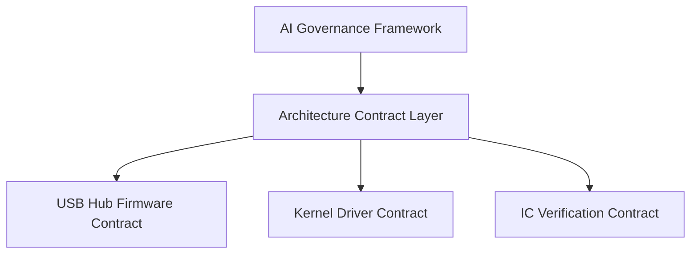

# Gavin Wu

Software Architecture / AI Governance

Exploring how **architecture contracts** can control and stabilize  
AI-assisted software development.

---

## Core Idea

Modern AI coding tools can generate working code.

But they often break **architecture boundaries**.

This project explores a different approach:

> Treat architecture as **machine-enforced governance rules**.

Instead of relying only on human code review,  
architecture constraints become **machine-readable contracts**.

---

## Architecture

## Architecture

Main Project
AI Governance Framework

A framework designed to ensure that AI coding tools
respect software architecture constraints.

Key ideas:

Architecture rules as machine-readable governance

Contract-driven development

Architecture drift detection

AI context governance

Repo:

https://github.com/GavinWu672/ai-governance-framework

Architecture Contract Experiments

These repositories apply governance concepts
to real engineering domains.

USB Hub Firmware Architecture Contract

Architecture constraints for embedded USB hub firmware systems.

Focus:

ISR safety

Shadow RAM state management

Memory resource constraints

Repo:

https://github.com/GavinWu672/USB-Hub-Firmware-Architecture-Contract

Kernel Driver Contract

Architecture governance for kernel-mode driver development.

Focus:

WDK safety rules

API surface protection

Kernel stability constraints

Repo:

https://github.com/GavinWu672/Kernel-Driver-Contract

IC Verification Contract

Architecture contracts for validation pipelines.

Focus:

Spec-driven verification

Reproducible test flows

Repo:

https://github.com/GavinWu672/IC-Verification-Contract

Research Direction

Current exploration areas:

AI coding governance

Architecture drift prevention

Contract-based development workflows

AI-assisted engineering safety

Goal

To explore whether architecture contracts can become
the missing layer between AI coding tools and real-world software systems.
