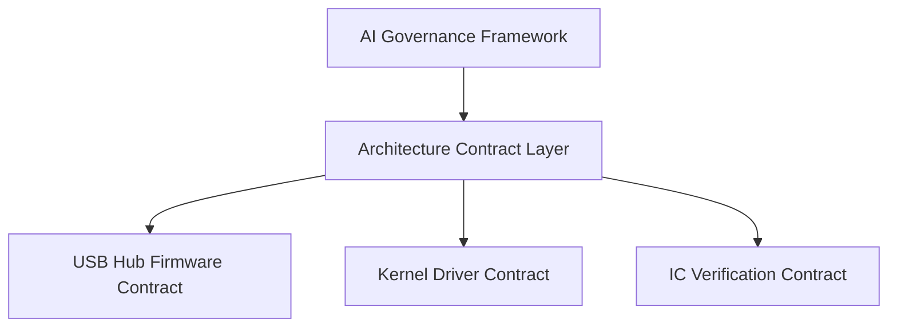

# Gavin Wu

**Software Architecture / AI Governance**

Exploring how **architecture contracts** can control and stabilize AI-assisted software development.

---

## Core Idea

Modern AI coding tools can generate working code — but they often break **architecture boundaries**.

This project explores a different approach:

> Treat architecture as **machine-enforced governance rules**.

Instead of relying only on human code review, architecture constraints become **machine-readable contracts** that AI tools must respect.

---

## Architecture

---

## Projects

### AI Governance Framework

A runtime framework that ensures AI coding tools respect software architecture constraints.

**Key capabilities**

- Architecture rules as machine-readable governance contracts
- Contract-driven development with domain plugin support
- Architecture drift detection
- Session lifecycle governance with audit trail

**Repo** → [ai-governance-framework](https://github.com/GavinWu672/ai-governance-framework)

---

### Architecture Contract Experiments

These repositories apply governance concepts to specific engineering domains, each acting as a domain plugin to the framework.

#### USB Hub Firmware Architecture Contract

Architecture constraints for embedded USB hub firmware systems.

**Focus**
- ISR safety and interrupt boundary enforcement
- Shadow RAM state management
- Memory resource constraints

**Repo** → [USB-Hub-Firmware-Architecture-Contract](https://github.com/GavinWu672/USB-Hub-Firmware-Architecture-Contract)

---

#### Kernel Driver Contract

Architecture governance for Windows kernel-mode driver development.

**Focus**
- WDK safety rules and IRQL boundary enforcement
- API surface protection
- Kernel stability constraints

**Repo** → [Kernel-Driver-Contract](https://github.com/GavinWu672/Kernel-Driver-Contract)

---

#### IC Verification Contract

Architecture contracts for IC validation pipelines.

**Focus**
- Spec-driven verification with machine-readable signal maps
- DUT boundary enforcement
- Reproducible test flows

**Repo** → [IC-Verification-Contract](https://github.com/GavinWu672/IC-Verification-Contract)

---

## Research Direction

Current exploration areas:

- AI coding governance and guardrail design
- Architecture drift prevention in long-running AI sessions
- Contract-based development workflows
- AI-assisted engineering safety in high-risk domains

---

## Goal

To explore whether **architecture contracts** can become the missing layer between AI coding tools and real-world software systems — where domain knowledge is proprietary, errors are costly, and human review alone is insufficient.
